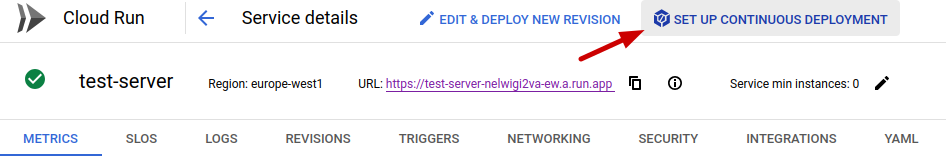
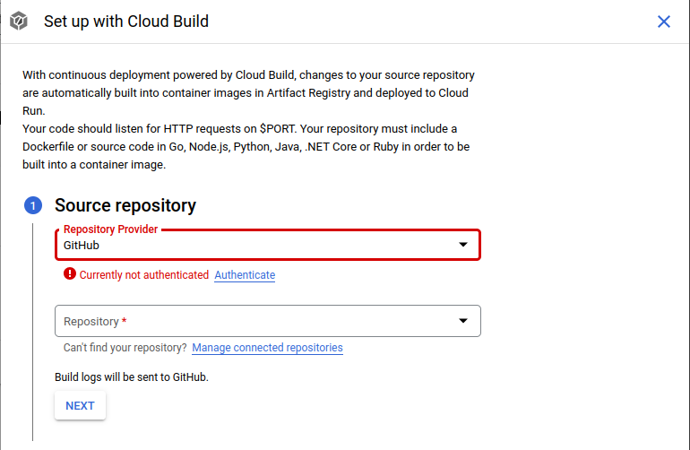
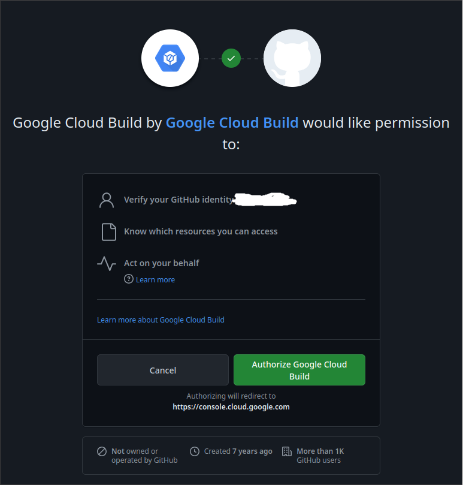
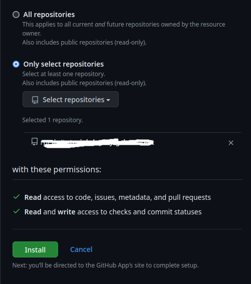
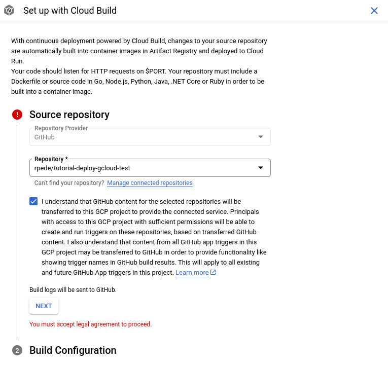
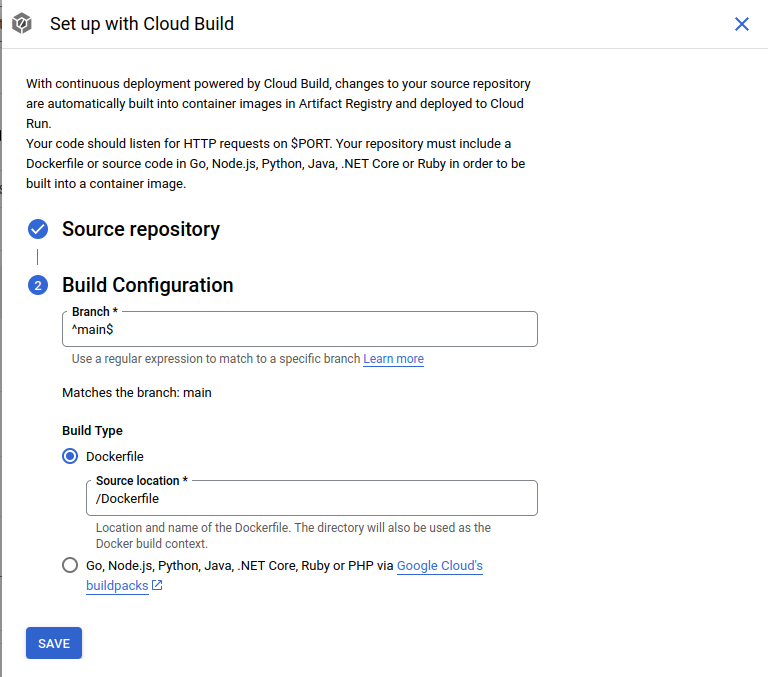
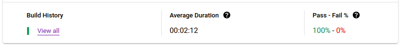

# Continuous Delivery

Continuous delivery (CD), sometimes called continuous deployment, requires the
deployment process.

We are going to improve on part 1, such that it automatically deploys a new
version whenever you push changes to **main** branch.

This can be combined with branch protection, tests and code-reviews to ensure we
don't accidentally break anything for our customers.

## Front-end

This time we will start with the front-end.
Run the following command to initialize GitHub integration for Firebase Hosting:

```sh
firebase init hosting:github
```

Open the shown URL in your browser and authorize Firebase CLI to access your
GitHub account.

When asked "For which GitHub repository would you like to set up a GitHub
workflow?", you need to find the GitHub page for your clone of this repository
then copy the last part of the URL and paste it as the answer.

Example:
If the full URL is `https://github.com/username/tutorial-deploy-gcloud` then
you use the part that says `username/tutorial-deploy-gcloud`.

Answer as shown for the other questions:

```
? Set up the workflow to run a build script before every deploy? Yes
? What script should be run before every deploy? npm clean-install --prefix client && npm run build --prefix client
? Set up automatic deployment to your site's live channel when a PR is merged? Yes
? What is the name of the GitHub branch associated with your site's live channel? main
```

It should have created two workflows in `.github/workflows/` folder.

1. `firebase-hosting-pull-request.yml` will deploy a preview for pull-request.
   It can be useful to manually test new features before going live.
   See [Deploy to live & preview channels via GitHub pull
   requests](https://firebase.google.com/docs/hosting/github-integration) for more
   information.
   It is overkill for what we are doing here though, so delete the file.
2. `firebase-hosting-merge.yml` will deploy a live version on
   merge and push to **main** branch.
   This is exactly what we need, so keep it.

Commit you changes and push to see it in action.

The site doesn't look any different, since the app is the same as in part 1.
But you can tell from the GitHub Actions log and the Firebase release log if it worked.
You can find release log under "Hosting" for the project in [Firebase
Console](https://console.firebase.google.com/project/).

## Back-end

Go to the [Cloud Run console](https://console.cloud.google.com/run) and click
on your service.

Click on the "Set up continuous deployment" button.



First time you do this, you will need to grant Google Cloud permission to
access your GitHub account.
To do that, click the "Authenticate" link.



Then "Authorize Google Cloud Build".



You also need to give Google Cloud Build permissions access your repository by
clicking "Manage connected repositories".
I would go with the option to only allow for the one repository you are using
for this guide.



Accept the terms.



Click "Next".



We want to deploy from the main branch and the Dockerfile for the Back-end is located at the repository root.
So the defaults here are okay.
Just hit "Save".

If you go to [Cloud Build console](https://console.cloud.google.com/cloud-build/dashboard).
You should see a build.



Hurray 🥳, you now have automated deployment.
Whenever you push changes to **main** branch of your repository then it will
automatically deploy a new version.

This setup can be combined with Continuous Integration workflow from my other
tutorials for a full [CI/CD](https://en.wikipedia.org/wiki/CI/CD) pipeline.
