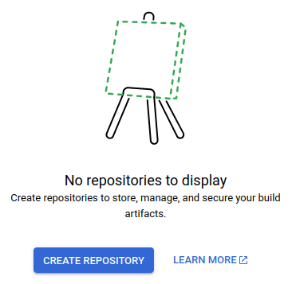

# Build container image locally

Here is a quick overview of what you will accomplish in this part of the guide.

1. Create an image repository with Artifact Registry.
2. Create a secret for database connection string using Secret Manager.
3. Build (locally) and push a container image for the back-end.
4. Start a container for the back-end using Cloud Run.
5. Make the connection string secret accessible to the container.
6. Build front-end (locally) and deploy it to Firebase Hosting using Firebase-CLI.
7. Specify rewrite rule to proxy requests to your back-end container.

## Back-end

## Image repository

Go to [Google Cloud Console](https://console.cloud.google.com) and sign in with
your account.

Create a new project from the drop-down left to the search bar.
Name it "Deploy tutorial" or something along those lines.

Create an Artifact Registry for storing our images.
You simply search for "artifact registry", then enable the API.


When it is done the button will change to "Manage".
Click it.

Then "Create Credentials" as it suggest.


Make sure you select "Application data".


You also need to create a repository in your Artifact Registry to store images.
Search for "artifact repositories", select "Repositories".


Click "Create Repository".



Give it a name.
Make sure "Format" is set to "Docker".
Set region to "europe-west1" and click "Create".


## Secrets

We need to create a secret for the database connection string.
We protect it with Secret Manager since access to it would allow an attacker
full access to mess around with the database.

Search "secret manager" and enable it.


Create a new secret.
Name it "AppDb".
In the "Secret value" field, insert your PostgreSQL connection string in .NET
format.


## Container image

1. Find you Artifact Registry repository
   1. Search "artifact repositories"
   2. Select "Repositories"
   3. Click the name of your repository (tutorial-backend)
2. Click "Setup Instructions" and paste the command into your terminal.
3. Click the copy icon next to repository path to copy a reference to it.


_Note: the name of your project and repository will be different_

We are now going to build an image locally and push it to the repository.

_Note: use git-bash terminal_

```sh
IMAGE_REPO="replace with the reference you copied"
docker build . -t $IMAGE_REPO/server
docker push $IMAGE_REPO/server
```

## Service

Here we are going to create a Cloud Run service to run the container.

Search "Cloud Run" and create a new service.


Then select the image you pushed in "Container image URL" field.


In **Configure** section:

- Enter a name for your service.
- Set region to europe-west1

**Authentication**

Select "Allow unauthenticated invocations".

**CPU allocation and pricing**

Here is just neat option I want to point out.
When you have "CPU is only allocated during request processing" selected, you
won't be charged anything when there is no traffic
to your service.
The downside is that it adds a small delay in response time after an idle
period.

**Container(s), Volumes, Networking, Security**

You could lower the resources a bit if you want.

The important setting is in "Variable & secrets" tab.
Here you need to add a reference to the `AppDb` secret you created earlier.
Set the name to `ConnectionStrings__AppDb`.


Click **Create** and wait a bit.

## Secret permissions

You will most likely see an error like this.


For security reasons you need to explicitly give access to secrets.

Search "IAM".
Edit the account with the name from the error.


Then add the "Secret Manager Secret Accessor" role and "Save".


Navigate back to your failing Cloud Run service.
Click "Edit & deploy new revision".


You don't need to change anything.
Just click "Deploy".

You should now see a "✅" next the service name.


Open the URL.
Then append `/api/blog` to the end.
You should see some JSON similar to this, but without line breaks.

````json
[
  {
    "id": 1,
    "title": "First post",
    "content": "## Hello Python\nHave you ever wondered how to make a hello-world application in Python?\n\nThe answer is simply:\n```py\nprint('Hello World!')",
    "author": {
      "id": "6b5d1e3d-02c7-49fe-ae84-1f2b1a462b4c",
      "userName": "admin@example.com"
    },
    "publishedAt": "2024-08-17T18:44:02.581083Z",
    "editedAt": null
  }
]
````

We are hitting an endpoint in the back-end which returns some data from the database.
It's a simple [smoke-test](<https://en.wikipedia.org/wiki/Smoke_testing_(software)>) showing that back-end is running and can connect to the database.

If it doesn't work, you might be able to find some
clues, by inspecting the logs for your Cloud Run service.

## Front-end

We could also build a container for front-end and deploy it with Cloud Run, similar to what we just
did with the back-end.
Instead, we are going to deploy the using Firebase Hosting.
With Firebase Hosting we have slightly less moving parts, meaning less we can screw up.

Go to <https://console.firebase.google.com/> and click:


Click:


Select the Google Cloud project you are using for this tutorial and accept the terms.

Open a terminal in the root of this repository.

```sh
npm clean-install --prefix client
npm run build --prefix client
firebase init hosting
```

Answer as shown here:

```
? Please select an option: Use an existing project
? Select a default Firebase project for this directory: deploy-tutorial
? What do you want to use as your public directory? client/dist
? Configure as a single-page app (rewrite all urls to /index.html)? Yes
? Set up automatic builds and deploys with GitHub? No
? File dist/index.html already exists. Overwrite? No
```

_Notice: I called my Google Cloud project for "deploy-tutorial".
Yours could be different._

Before actually deploying, we need some way of letting the front-end know where
to find the back-end.
The front-end in this repository is currently set up to use relative URLs when
requesting the back-end.
If you are unsure what a relative URL is [see
here](https://stackoverflow.com/questions/2005079/absolute-vs-relative-urls).
When running the front-end locally, it is set up to
[proxy](https://en.wikipedia.org/wiki/Proxy_server#Web_proxy_servers) all
requests for `/api` to the back-end server address.
See `client/vite.config.ts` and
[here](https://vitejs.dev/config/server-options#server-proxy) for details.


We can configure Firebase Hosting to do the same.
The cool thing about this setup, is that we don't have to go change the address
for back-end (between localhost and Cloud Run service) whenever we are about to deploy.

Change `firebase.json` to:

```json
{
  "hosting": {
    "public": "client/dist",
    "ignore": ["firebase.json", "**/.*", "**/node_modules/**"],
    "rewrites": [
      {
        "source": "/api/**",
        "run": {
          "serviceId": "ID of back-end Cloud Run service",
          "region": "Region for the service"
        }
      },
      {
        "source": "**",
        "destination": "/index.html"
      }
    ]
  }
}
```

Replace `serviceId` and `region` with the values for your Cloud Run service for
the back-end.

You can retrieve the values with:

```sh
gcloud run services list
```

If you get an error, it could be because you need to tell `gcloud` what project
to look at.
To fix this, go to <https://console.cloud.google.com>.
Click the project drop-down between logo and search bar.
Copy the ID.


Then:

```sh
gcloud config set project replace-this-with-your-project-id
gcloud run services list
```

Here you can see service ID and region.
Replace the values in the `firebase.json` file.

You can now deploy with:

```sh
firebase deploy --only hosting
```

Open the "Hosting URL" from output in your web-browser.

Here is what it should look like.


You have now successfully deployed a full web-app to Google Cloud 🥳.
